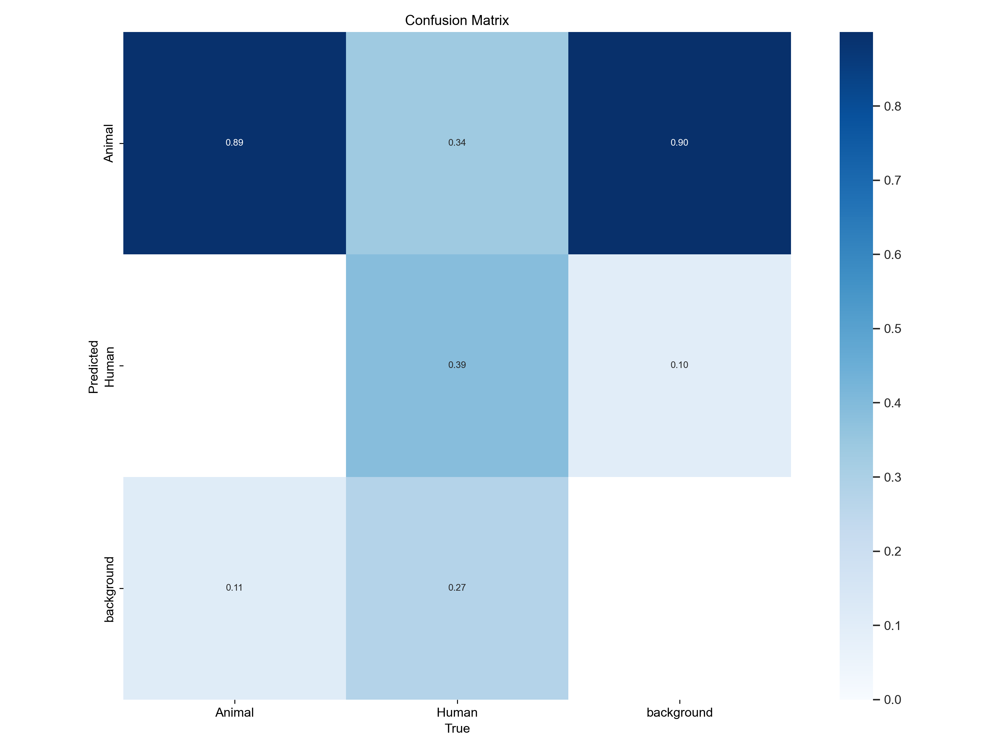

# Deep-Learning-For-UAV-Wildlife-Surveillance

## Overview
This project explores the use of deep learning methods for detecting and classifying humans and animals in aerial thermal imagery collected by UAVs. The primary objective is to support anti-poaching surveillance efforts by enabling **real-time monitoring** of protected wildlife areas.

We leverage the **BIRDSAI dataset** and implement a **YOLOv5-based model** with techniques such as:
- Weighted Cross-Entropy Loss to handle class imbalance
- Pseudo-labeling of synthetic data
- Real-time inference optimization

Our model improves human recall rates from **39% → 76%**, demonstrating significant potential for UAV-based wildlife surveillance.

---

## Sources
- 📄 **Final Paper:** [PH451 Final Paper – Hanley, Pierre, Prasad](./PH451FinalPaper_Hanley_Pierre_Prasad.pdf)  
  Contains full methodology, dataset description, model architecture, training details, and experimental results.

- 📊 **Presentation Slides:** [PH451 Project Presentation Group 5](./PH%20451%20Project%20Presentation%20Group%205.pptx)  
  Provides a summarized overview of the problem, model pipeline, results, and discussion.

---

## Dataset
- **Name:** [BIRDSAI Dataset](https://universe.roboflow.com/birdsai/birdsai-duqdg)
- **Content:** 27,000 LWIR images (447 labeled real images, remainder synthetic)  
- **Classes:** `Human` and `Animal`  
- **Challenges:** Severe class imbalance, variable vantage points, fog interference.

---

## Model
- **Base Model:** YOLOv5 with CSPDarknet-53 backbone  
- **Loss Function:** Weighted Cross-Entropy  
- **Optimizer:** Adam (momentum = 0.937, weight decay = 5×10⁻⁵)  
- **Training Strategy:**  
  - Phase 1: Trained on real labeled images (447 samples)  
  - Phase 2: Used pseudo-labeling to expand labeled dataset to 1000+ images  
- **Results:** Improved human recall to 76% with efficient inference (~0.066s per frame).

---
## Results

*Confusion Matrix showing improved detection performance.

*Precision-Recall Curve indicating model performance.

*R Curve demonstrating recall improvement.

*P Curve showing precision metrics.

---

## Real-World Application
- Real-time detection of human activity in UAV video streams
- Automated alerts when human presence is detected in successive frames
- Potential to reduce poaching activity by improving surveillance coverage.

---

## References
1. Bondi et al., *SPOT Poachers in Action: Augmenting Conservation Drones With Automatic Detection in Near Real Time* (2018).  
2. Cazzato et al., *A Survey of Computer Vision Methods for 2D Object Detection from UAVs* (2020).  
3. Redmon et al., *You Only Look Once (YOLO)* (2015).  
4. BIRDSAI Dataset, *Detection and Tracking in Aerial Thermal Infrared Videos* (2020).

---

## Team
- Colin Hanley  
- Jasmine Pierre  
- Gowtham Prasad  